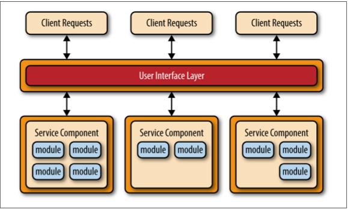
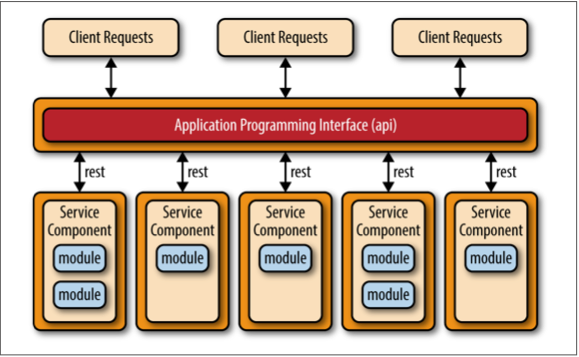
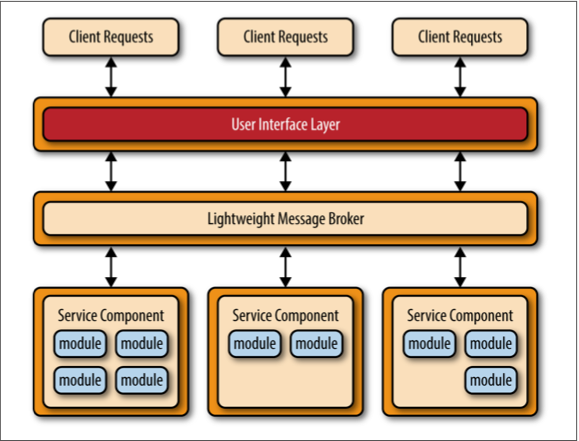

# 第四章 微服务架构 
The microservices architecture pattern is quickly gaining ground in the industry as a viable alternative to monolithic applications and service-oriented architectures. Because this architecture pattern is still evolving, there’s a lot of confusion in the industry about what this pattern is all about and how it is implemented. This section of the report will provide you with the key concepts and foundational knowledge necessary to understand the benefits (and trade-offs) of this important architecture pattern and whether it is the right pat‐ tern for your application.

微服务架构模式作为替代monolithic应用和面向服务架构的一个可行的选择，在业内迅速取得进展。由于这个架构模式仍然在不断的发展中，在业界存在很多困惑——这种模式是关于什么的？它是如何实现的？本报告的这部分将为你提供关键概念和必要的基础知识来理解这一重要架构模式的好处(和取舍)，以此来判断这种架构是否适合你的应用。

## Pattern Description 模式描述
Regardless of the topology or implementation style you chose, there are several common core concepts that apply to the general architecture pattern. The first of these concepts is the notion of separately deployed units. As illustrated in Figure 4-1, each component of the microservices architecture is deployed as a separate unit, allowing for easier deployment through an effective and streamlined delivery pipeline, increased scalability, and a high degree of application and component decoupling within your application.

不管你选择哪种拓扑或实现风格,有几种常见的核心概念适用于一般架构模式。第一个概念是*单独部署单元*。如图4-1所示，微服务架构的每个组件都作为一个独立单元进行部署，让每个单元可以通过有效、简化的传输管道进行通信，同时它还有很强的扩展性，应用和组件之间高度解耦，使得部署更为简单。

Perhaps the most important concept to understand with this pattern is the notion of a service component. Rather than think about services within a microservices architecture, it is better to think about service components, which can vary in granularity from a single module to a large portion of the application. Service components contain one or more modules (e.g., Java classes) that represent either a single-purpose function (e.g., providing the weather for a specific city or town) or an independent portion of a large business application (e.g., stock trade placement or determining auto-insurance rates). Designing the right level of service component granularity is one of the biggest challenges within a microservices architecture. This challenge is discussed in more detail in the following service component orchestration subsection.

也许要理解这种模式，最重要的概念就是服务组件（service component）。不要考虑微服务架构内部的服务，而最好是考虑服务组件，从粒度上讲它可以小到单一的模块，或者大至一个应用程序。服务组件包含一个或多个模块（如Java类），这些模块可以提供一个单一功能（如，为特定的城市或城镇提供天气情况），或也可以作为一个大型商业应用的一个独立部分（如，股票交易布局或测定汽车保险的费率）。在微服务架构中，正确设计服务组件的粒度是一个很大的挑战。在接下来的服务组件部分对这一挑战进行了详细的讨论。

     
Figure 4-1. Basic Microservices architecture pattern  图 4-1. 基本微服务架构模式

Another key concept within the microservices architecture pattern is that it is a distributed architecture, meaning that all the components within the architecture are fully decoupled from one other and accessed through some sort of remote access protocol (e.g., JMS, AMQP, REST, SOAP, RMI, etc.). The distributed nature of this architecture pattern is how it achieves some of its superior scalability and deployment characteristics.

微服务架构模式的另一个关键概念是它是一个*分布式*的架构，这意味着架构内部的所有组件之间是完全解耦的，并通过某种远程访问协议（如， JMS, AMQP, REST, SOAP, RMI等）进行访问。这种架构的分布式特性是它实现一些优越的可扩展性和部署特性的关键所在。

One of the exciting things about the microservices architecture is that it evolved from issues associated with other common architecture patterns, rather than being created as a solution waiting for a problem to occur. The microservices architecture style naturally evolved from two main sources: monolithic applications developed using the layered architecture pattern and distributed applications developed through the service-oriented architecture pattern.

微服务架构另一个令人兴奋的特性是它是由其他常见架构模式存在的问题演化来的，而不是作为一个解决方案被创造出来等待问题出现。微服务架构的演化有两个主要来源：使用分层架构模式的monolithic应用和使用面向服务架构的分布式应用。

The evolutionary path from monolithic applications to a microservices architecture style was prompted primarily through the development of continuous delivery, the notion of a continuous deployment pipeline from development to production which streamlines the deployment of applications. Monolithic applications typically consist of tightly coupled components that are part of a single deployable unit, making it cumbersome and difficult to change, test, and deploy the application (hence the rise of the common “monthly deployment” cycles typically found in most large IT shops). These factors commonly lead to brittle applications that break every time something new is deployed. The microservices architecture pattern addresses these issues by separating the application into multiple deployable units (service components) that can be individually developed, tested, and deployed independent of other service components.

由单体应用( 一个应用就是一个整体 )到微服务的发展过程主要是由持续交付开发促成的。从开发到生产的持续部署管道概念,简化了应用程序的部署。单体应用通常是由紧耦合的组件组成，这些组件同时又是另一个单一可部署单元的一部分，这使得它繁琐，难以改变、测试和部署应用（因此常见的“月度部署”周期出现并通常发生在大型IT商店项目）。这些因素通常会导致应用变得脆弱以至于每次有一点新功能部署后应用就不能运行。微服务架构模式通过将应用分隔成多个可部署的单元（服务组件）的方法来解决这一问题，这些服务组件可以独立于其他服务组件进行单独开发、测试和部署。

The other evolutionary path that lead to the microservices architecture pattern is from issues found with applications implementing the service-oriented architecture pattern (SOA). While the SOA pattern is very powerful and offers unparalleled levels of abstraction, heterogeneous connectivity, service orchestration, and the promise of aligning business goals with IT capabilities, it is nevertheless complex, expensive, ubiquitous, difficult to understand and implement, and is usually overkill for most applications. The microservices architecture style addresses this complexity by simplifying the notion of a service, eliminating orchestration needs, and simplifying connectivity and access to service components.

另一个导致微服务架构模式产生的演化过程是由面向服务架构模式（SOA）应用程序存在的问题引起的。虽然SOA模式非常强大，提供了无与伦比的抽象级别、异构连接、服务编排，并保证通过IT能力调整业务目标，但它仍然是复杂的,昂贵的,普遍存在，它很难理解和实现，对大多数应用程序来说过犹不及。微服务架构通过简化服务概念，消除编排需求、简化服务组件连接和访问来解决复杂度问题。

## Pattern Topologies 模式拓扑
While there are literally dozens of ways to implement a microservices architecture pattern, three main topologies stand out as the most common and popular: the API REST-based topology, 基于REST的应用 topology, and the centralized messaging topology.

虽然有很多方法来实现微服务架构模式,但三个主要的拓扑结构脱颖而出，最常见和流行的有:API REST-based 拓扑结构,基于REST的应用拓扑结构和集中式消息拓扑结构。

The API REST-based topology is useful for websites that expose small, self-contained individual services through some sort of API (application programming interface). This topology, which is illustrated in Figure 4-2, consists of very fine-grained service components (hence the name microservices) that contain one or two modules that perform specific business functions independent from the rest of the services. In this topology, these fine-grained service components are typically accessed using a REST-based interface implemented through a separately deployed web-based API layer. Examples of this topology include some of the common single-purpose cloud-based RESTful web services found by Yahoo, Google, and Amazon.

基于REST的API拓扑适用于网站，通过某些API（application programming interface）对外提供小型的、自包含的服务。这种拓扑结构,如图4 - 2所示,由粒度非常细的服务组件（因此得名微服务）组成，这些服务组件包含一个或两个模块并独立于其他服务来执行特定业务功能。在这种拓结构扑中,这些细粒度的服务组件通常被REST-based的接口访问，而这个接口是通过一个单独部署的web API层实现的。此种拓扑的例子包含一些常见的专用的、基于云的RESTful web service，大型网站像Yahoo, Google, and Amazon都在使用。

     
Figure 4-2. API REST-based topology  图 4-2. API REST-based拓扑结构

The application REST-based topology differs from the API REST- based approach in that client requests are received through traditional web-based or fat-client business application screens rather than through a simple API layer. As illustrated in Figure 4-3, the user-interface layer of the application is deployed as a separate web application that remotely accesses separately deployed service components (business functionality) through simple REST-based interfaces. The service components in this topology differ from those in the API-REST-based topology in that these service components tend to be larger, more coarse-grained, and represent a small portion of the overall business application rather than fine-grained, single-action services. This topology is common for small to medium-sized business applications that have a relatively low degree of complexity.

基于REST的应用拓扑结构与API REST- based不同，它通过传统的基于web的或胖客户端业务应用来接收客户端请求，而不是通过一个简单的API层。如图4-3所示，应用的用户接口层（user interface layer）是一个web应用，可以通过简单的REST-based接口访问单独部署的服务组件（业务功能）。该拓扑结构中的服务组件与API-REST-based拓扑结构中的不同，这些服务组件往往会更大、粒度更粗、代表整个业务应用程序的一小部分，而不是细粒度的、单一操作的服务。这种拓扑结构常见于中小型企业等复程度相对较低的应用程序。

     
Figure 4-3. 基于REST的应用 topology 图 4-3. 基于REST的应用 拓扑结构

Another common approach within the microservices architecture pattern is the centralized messaging topology. This topology (illustrated in Figure 4-4) is similar to the previous application REST- based topology except that instead of using REST for remote access, this topology uses a lightweight centralized message broker (e.g., ActiveMQ, HornetQ, etc.). It is vitally important when looking at this topology not to confuse it with the service-oriented architecture pattern or consider it “SOA-Lite." The lightweight message broker found in this topology does not perform any orchestration, transformation, or complex routing; rather, it is just a lightweight transport to access remote service components.

微服务架构模式中另一个常见的方法是集中式消息拓扑。该拓扑（如图4-4所示）与前面提到的基于REST的应用拓扑类似，不同的是，application REST- based拓扑结构使用REST进行远程访问，而该拓扑结构则使用一个轻量级的集中式消息代理（如，ActiveMQ, HornetQ等等）。不要将该拓扑与面向服务架构模式混淆或将其当做SOA简化版（“SOA-Lite”），这点是极其重要的。该拓扑中的轻量级消息代理（Lightweight Message Broker）不执行任何编排,转换,或复杂的路由;相反,它只是一个轻量级访问远程服务组件的传输工具。

The centralized messaging topology is typically found in larger business applications or applications requiring more sophisticated control over the transport layer between the user interface and the service components. The benefits of this topology over the simple REST-based topology discussed previously are advanced queuing mechanisms, asynchronous messaging, monitoring, error handling, and better overall load balancing and scalability. The single point of failure and architectural bottleneck issues usually associated with a centralized broker are addressed through broker clustering and broker federation (splitting a single broker instance into multiple broker instances to divide the message throughput load based on functional areas of the system).

集中式消息拓扑结构通常应用在较大的业务应用程序中，或对于某些对传输层到用户接口层或者到服务组件层有较复杂的控制逻辑的应用程序中。该拓扑较之先前讨论的简单基于REST的拓扑结构，其好处是有先进的排队机制、异步消息传递、监控、错误处理和更好的负载均衡和可扩展性。与集中式代理相关的单点故障和架构瓶颈问题已通过代理集群和代理联盟（将一个代理实例为分多个代理实例，把基于系统功能区域的吞吐量负载划分开处理）解决。

   

Figure 4-4. Centralized messaging topology  图 4-4. 集中式消息拓扑结构

## Avoid Dependencies and Orchestration 避免依赖和编排
One of the main challenges of the microservices architecture pattern is determining the correct level of granularity for the service components. If service components are too coarse-grained you may not realize the benefits that come with this architecture pattern (deployment, scalability, testability, and loose coupling). However, service components that are too fine-grained will lead to service orchestration requirements, which will quickly turn your lean microservices architecture into a heavyweight service-oriented architecture, complete with all the complexity, confusion, expense, and fluff typically found with SOA-based applications.

微服务架构模式的主要挑战之一就是决定服务组件的粒度级别。如果服务组件粒度过粗，那你可能不会意识到这个架构模式带来的好处（部署、可扩展性、可测试性和松耦合），然而,服务组件粒度过细将导致服务编制要求,这会很快导致将微服务架构模式变成一个复杂、容易混淆、代价昂贵并易于出错的重量级面向服务架构。

If you find you need to orchestrate your service components from within the user interface or API layer of the application, then chances are your service components are too fine-grained. Similarly, if you find you need to perform inter-service communication between service components to process a single request, chances are your service components are either too fine-grained or they are not partitioned correctly from a business functionality standpoint.

如果你发现需要从应用内部的用户接口或API层编排服务组件，那么很有可能你服务组件的粒度太细了。如果你发现你需要在服务组件之间执行服务间通信来处理单个请求,那么很有可能要么是你服务组件的粒度太细了，要么是没有从业务功能角度正确划分服务组件。

Inter-service communication, which could force undesired couplings between components, can be handled instead through a shared database. For example, if a service component handing Internet orders needs customer information, it can go to the database to retrieve the necessary data as opposed to invoking functionality within the customer-service component.

服务间通信，可能导致组件之间产生耦合，但可以通过共享数据库进行处理。例如，若一个服务组件处理网络订单而需要用户信息时，它可以去数据库检索必要的数据，而不是调用客户服务组件的功能。

The shared database can handle information needs, but what about shared functionality? If a service component needs functionality contained within another service component or common to all service components, you can sometimes copy the shared functionality across service components (thereby violating the DRY principle: don’t repeat yourself). This is a fairly common practice in most business applications implementing the microservices architecture pattern, trading off the redundancy of repeating small portions of business logic for the sake of keeping service components independent and separating their deployment. Small utility classes might fall into this category of repeated code.

共享数据库可以处理信息需求，但是共享功能呢？如果一个服务组件需要的功能包含在另一个服务组件内，或是一个公共的功能,那么有时你可以将服务组件的共享功能复制一份（因此违反了DRY规则：don’t repeat yourself）。为了保持服务组件独立和部署分离，微服务架构模式实现中会存在一小部分由重复的业务逻辑而造成的冗余，这在大多数业务应用程序中是一个相当常见的问题。小工具类可能属于这一类重复的代码。

If you find that regardless of the level of service component granularity you still cannot avoid service-component orchestration, then it’s a good sign that this might not be the right architecture pattern for your application. Because of the distributed nature of this pattern, it is very difficult to maintain a single transactional unit of work across (and between) service components. Such a practice would require some sort of transaction compensation framework for rolling back transactions, which adds significant complexity to this relatively simple and elegant architecture pattern.

如果你发现就算不考虑服务组件粒度的级别，你仍不能避免服务组件编排,这是一个好迹象,可能此架构模式不适用于你的应用。由于这种模式的分布式特性，很难维护服务组件之间的单一工作事务单元。这种做法需要某种事务补偿框架回滚事务,这对此相对简单而优雅的架构模式来说，显著增加了复杂性。

## Considerations 架构考量
The microservices architecture pattern solves many of the common issues found in both monolithic applications as well as service-oriented architectures. Since major application components are split up into smaller, separately deployed units, applications built using the microservices architecture pattern are generally more robust, provide better scalability, and can more easily support continuous delivery.

微服务架构模式解决了很多单体应用和面向服务架构应用存在的问题。由于主要应用组件被分成更小的,单独部署单元,使用微服务架构模式构建的应用程序通常更健壮,并提供更好的可扩展性,支持持续交付也更容易。

Another advantage of this pattern is that it provides the capability to do real-time production deployments, thereby significantly reducing the need for the traditional monthly or weekend “big bang” production deployments. Since change is generally isolated to specific service components, only the service components that change need to be deployed. If you only have a single instance of a service component, you can write specialized code in the user interface application to detect an active hot-deployment and redirect users to an error page or waiting page. Alternatively, you can swap multiple instances of a service component in and out during a real-time deployment, allowing for continuous availability during deployment cycles (something that is very difficult to do with the layered architecture pattern).

该模式的另一个优点是,它提供了实时生产部署能力，从而大大减少了传统的月度或周末“大爆炸”生产部署的需求。因为变化通常被隔离成特定的服务组件，只有变化的服务组件才需要部署。如果你的服务组件只有一个实例，你可以在用户界面程序编写专门的代码用于检测一个活跃的热部署,一旦检测到就将用户重定向到一个错误页面或等待页面。你也可以在实时部署期间，将服务组件的多个实例进行交换，允许应用程序在部署期间保持持续可用性（分层架构模式很难做到这点）。

One final consideration to take into account is that since the microservices architecture pattern is a distributed architecture, it shares some of the same complex issues found in the event-driven architecture pattern, including contract creation, maintenance, and government, remote system availability, and remote access authentication and authorization.

最后一个要重视的考虑是，由于微服务架构模式是分布式的架构，他与事件驱动架构模式具有一些共同的复杂的问题，包括约定的创建、维护，和管理，远程系统的可用性，远程访问身份验证和授权。

## Pattern Analysis 模式分析
The following table contains a rating and analysis of the common architecture characteristics for the microservices architecture pattern. The rating for each characteristic is based on the natural tendency for that characteristic as a capability based on a typical implementation of the pattern, as well as what the pattern is generally known for. For a side-by-side comparison of how this pattern relates to other patterns in this report, please refer to Appendix A at the end of this report.

下面这个表中包含了微服务架构模式的特点分析和评级，每个特性的评级是基于自然趋势，基于典型模式实现的能力特性,以及该模式是以什么闻名的。本报告中该模式与其他模式的并排比较，请参考报告最后的附件A。

### Overall agility 整体灵活性
Rating: High     
Analysis: Overall agility is the ability to respond quickly to a constantly changing environment. Due to the notion of separately deployed units, change is generally isolated to individual service components, which allows for fast and easy deployment. Also, applications build using this pattern tend to be very loosely coupled, which also helps facilitate change.

评级：高

分析：整体的灵活性是能够快速响应不断变化的环境。由于单独部署单元的概念,变化通常被隔离成单独的服务组件,使得部署变得快而简单。同时，使用这种模式构建的应用往往是松耦合的，也有助于促进改变。

### Ease of deployment 易部署性
Rating: High     
Analysis: Overall this pattern is relatively easy to deploy due to the decoupled nature of the event-processor components. The broker topology tends to be easier to deploy than the mediator topology, primarily because the event-mediator component is somewhat tightly coupled to the event processors: a change in an event processor component might also require a change in the event mediator, requiring both to be deployed for any given change.

评级：高

分析：整体来讲，由于该模式的解耦特性和事件处理组件使得部署变得相对简单。broker拓扑往往比mediator拓扑更易于部署，主要是因为event-mediator组件与事件处理器是紧耦合的，事件处理器组件有一个变化可能导致event mediator跟着变化，有任何变化两者都需要部署。

### Testability 可测试性
Rating: High     
Analysis: Due to the separation and isolation of business functionality into independent applications, testing can be scoped, allowing for more targeted testing efforts. Regression testing for a particular service component is much easier and more feasible than regression testing for an entire monolithic application. Also, since the service components in this pattern are loosely coupled, there is much less of a chance from a development perspective of making a change that breaks another part of the application, easing the testing burden of having to test the entire application for one small change.

评级：高

分析：由于业务功能被分离成独立的应用模块,可以在局部范围内进行测试，这样测试工作就更有针对性。对一个特定的服务组件进行回归测试比对整个monolithic应用程序进行回归测试更简单、更可行。而且,由于这种模式的服务组件是松散耦合的，从开发角度来看，由一个变化导致应用其他部分也跟着变化的几率很小，并能减小由于一个微小的变化而不得不对整个应用程序进行测试的负担。

### Performance 性能
Rating: Low     
Analysis: While you can create applications implemented from this pattern that perform very well, overall this pattern does not naturally lend itself to high-performance applications due to the distributed nature of the microservices architecture pattern.

评级：低

分析：虽然你可以从实现该模式来创建应用程序并可以很好的运行，整体来说，由于微服务架构模式的分布式特性，并不适用于高性能的应用程序。

### Scalability 可扩展性
Rating: High     
Analysis: Because the application is split into separately deployed units, each service component can be individually scaled, allowing for fine-tuned scaling of the application. For example, the admin area of a stock-trading application may not need to scale due to the low user volumes for that functionality, but the trade-placement service component may need to scale due to the high throughput needed by most trading applications for this functionality.

评级：高

分析：由于应用程序被分为单独的部署单元,每个服务组件可以单独扩展，并允许对应用程序进行扩展调整。例如，股票交易的管理员功能区域可能不需要扩展，因为使用该功能的用户很少，但是交易布局服务组件可能需要扩展，因为大多数交易应用程序需要具备处理高吞吐量的功能。

### Ease of development 开发容易度
Rating: High     
Analysis: Because functionality is isolated into separate and distinct service components, development becomes easier due to the smaller and isolated scope. There is much less chance a developer will make a change in one service component that would affect other service components, thereby reducing the coordination needed among developers or development teams.

评级：高

分析：由于功能被分隔成不同的服务组件，由于开发范围更小且被隔离，开发变得更简单。程序员在一个服务组件做出一个变化影响其他服务组件的几率是很小的，从而减少开发人员或开发团队之间的协调。
